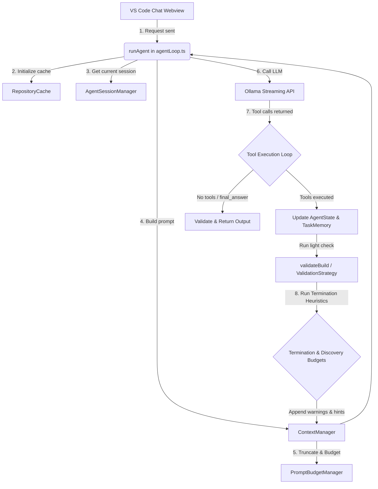

# GBS Local Dev: Agent Architecture

This document explains the architecture of the **GBS Local Dev** software agent extension, detailing how each component works, the role of each file, and the overall execution flow.

---

## 1. High-Level Flow Diagram

The following diagram illustrates the execution cycle of the agent loop when a user submits a request.

---

## 2. Core Components and File Map

### Extension & Webview Setup
* **[src/extension.ts](file:///d:/inittest_vsext/gbs-local-dev/src/extension.ts)**
  * **Role:** Entry point for the VS Code extension commands and views.
* **[src/chatView.ts](file:///d:/inittest_vsext/gbs-local-dev/src/chatView.ts)**
  * **Role:** UI-only sidebar provider that handles chat layouts and streams messages.
  * **Key Features:** Uses `vscode.getState()` and `vscode.setState()` to save and restore chat layouts, inputs, and thinking states across tab switches.

### Agent Core & Memory
* **[src/agent/sessionManager.ts](file:///d:/inittest_vsext/gbs-local-dev/src/agent/sessionManager.ts)**
  * **Role:** Persistent session manager managing `TaskMemory` and `SessionMemory`.
  * **Key Features:**
    * Keeps chat history in memory.
    * Persists completed goal summaries to `.vscode/bunker-session.json` with workspace isolation path hashing.
    * Registers listeners to reset state when the active workspace folder changes.
* **[src/agent/contextRetrieval.ts](file:///d:/inittest_vsext/gbs-local-dev/src/agent/contextRetrieval.ts)**
  * **Role:** Context Retrieval Service that scores/ranks matching workspace files, lazily indexes symbols, queries related files, and filters prior sessions for relevance.
* **[src/agent/agentLoop.ts](file:///d:/inittest_vsext/gbs-local-dev/src/agent/agentLoop.ts)**
  * **Role:** Orchestrates the step-by-step thinking loop of the agent (max 20 iterations).
  * **Key Functions/Helpers:**
    * `runAgent()`: Orchestrates execution, resets `TaskMemory` per request, tracks discovery counters, initializes generic task plans, and enforces budgets.
    * `detectLoopPattern()`: Signature-based repeated/reversed edit detection.
    * `extractToolCalls()`: Parses JSON blocks.
    * `extractRejectedFiles()`: Parses optional irrelevant files marked by the model to exclude them from future review.
    * `updatePlanProgress()`: Automatically marks task subtasks as completed.
* **[src/agent/context.ts](file:///d:/inittest_vsext/gbs-local-dev/src/agent/context.ts)**
  * **Role:** Handles prompt composition and keeps conversation history.
* **[src/agent/budget.ts](file:///d:/inittest_vsext/gbs-local-dev/src/agent/budget.ts)**
  * **Role:** Controls prompt context size. Refactors prompts to follow the structured context layout (Repository Profile, Workspace Snapshot, Working Context, Task Plan, Goal, Task Memory [Active, Related, Visited, and Rejected files], Relevance-Filtered Session Learning, and User Request).
* **[src/agent/types.ts](file:///d:/inittest_vsext/gbs-local-dev/src/agent/types.ts)**
  * **Role:** Defines standard types (`TaskMemory`, `SessionMemory`, `AgentSession`, `RunningAgent`, `TaskPlan`, `TaskSubtask`).

### Repository & Cache
* **[src/agent/cache.ts](file:///d:/inittest_vsext/gbs-local-dev/src/agent/cache.ts)**
  * **Role:** Singleton workspace cache storing workspace files list and contents, and generating `WorkspaceSnapshot` records.
* **[src/agent/analyzer.ts](file:///d:/inittest_vsext/gbs-local-dev/src/agent/analyzer.ts)**
  * **Role:** Analyzes root configuration files to identify project language and framework.

### Validation & Verification
* **[src/agent/validator.ts](file:///d:/inittest_vsext/gbs-local-dev/src/agent/validator.ts)**
  * **Role:** Verifies project correctness after modifications.
* **[src/agent/errorExtractor.ts](file:///d:/inittest_vsext/gbs-local-dev/src/agent/errorExtractor.ts)**
  * **Role:** Compresses build failure logs.

---

## 3. Tool Ecosystem

All tools extend the `Tool` interface and are registered inside **[src/agent/registry.ts](file:///d:/inittest_vsext/gbs-local-dev/src/agent/registry.ts)**:

1. **`list_workspace_files` ([listFiles.ts](file:///d:/inittest_vsext/gbs-local-dev/src/agent/tools/listFiles.ts))**: Exposes relative paths of all workspace files.
2. **`read_file` ([readFile.ts](file:///d:/inittest_vsext/gbs-local-dev/src/agent/tools/readFile.ts))**: Reads content from files.
3. **`write_file` ([writeFile.ts](file:///d:/inittest_vsext/gbs-local-dev/src/agent/tools/writeFile.ts))**: Overwrites or creates complete file contents.
4. **`create_file` ([createFile.ts](file:///d:/inittest_vsext/gbs-local-dev/src/agent/tools/createFile.ts))**: Initializes new files.
5. **`replace_in_file` ([replaceInFile.ts](file:///d:/inittest_vsext/gbs-local-dev/src/agent/tools/replaceInFile.ts))**: Search-and-replace tool. Normalizes line endings and immediately returns `"NO_CHANGES_REQUIRED"` if search and replace blocks match.
6. **`search_symbols` ([searchSymbols.ts](file:///d:/inittest_vsext/gbs-local-dev/src/agent/tools/searchSymbols.ts))**: Performs efficient symbol searches via index, falling back to text.
7. **`run_terminal_command` ([runCommand.ts](file:///d:/inittest_vsext/gbs-local-dev/src/agent/tools/runCommand.ts))**: Runs shell operations in the workspace root.
8. **`finish` ([finish.ts](file:///d:/inittest_vsext/gbs-local-dev/src/agent/tools/finish.ts))**: Terminating tool to signal task completion. Generates task summaries and updates SessionMemory.
9. **`get_directory_context` ([getDirectoryContext.ts](file:///d:/inittest_vsext/gbs-local-dev/src/agent/tools/getDirectoryContext.ts))**: Fetches directory structure, including sibling files, child routes, and nearby components/pages to avoid full workspace scans.

---

## 4. Loop Prevention & Termination Heuristics

The agent loop utilizes deterministic heuristics to prevent runaway reasoning loops and reduce token consumption:

* **Task Planning Layer**: Initializes a generic 5-step task plan template at startup, and automatically tracks progress/marks checkboxes during execution.
* **Proactive Context Retrieval Service**: Scores/ranks matching workspace files, lazily indexes symbols on-demand, filters historical sessions for keyword/file relevance, and injects `Working Context` directly into prompt builders before execution.
* **Proactive Sibling & Related File Injection**: Appends Same Directory, Child Routes, and Nearby Components (capped at 10) to successful `read_file` responses, providing local workspace awareness without requiring additional tool calls.
* **Adaptive Discovery Blocking**: Discovery tools (`list_workspace_files`, `search_symbols`) are deprioritized, allowing up to 3 discovery attempts and blocking if no new files/symbols are found.
* **Discovery Budget**:
  * Excludes `read_file`, applying only to `list_workspace_files` and `search_symbols`.
  * **Warning (at 15 calls)**: Nudges the model that sufficient context has been reviewed.
  * **Hard Block (at 30 calls)**: Blocks discovery tool execution and returns a choice selection warning, forcing the model to proceed to edit or finish.
* **Repeated Reads Warning**: If the same file is read more than 3 times without modification, returns a warning instructing the model not to read it again.
* **Alternating Pattern Warning**: If the model alternates between `list_workspace_files` and `read_file` 3 times, returns a warning that the model appears to be stuck.
* **Repeated Discovery Warning**: Injects warnings if the same file or query is requested again in the same task run.
* **Duplicate Read Protection**: If a file is re-read by the agent and its content matches the cache from the previous read, the loop returns cached content and appends a warning reminder.
* **Modification Budgets**:
  * **Per-File Budget**: Caps edits to a single file at 5 per execution.
  * **Global Budget**: Caps total edits across all files at 15 per execution.
* **Completion Heuristic & Hints**:
  * Completion reminder matches compile status, modification count, and completed objectives count.
  * Hint counter compiles subtle warnings (reads, budgets, loops, passes). When `finishHints >= 3`, a strong finish warning is appended.

