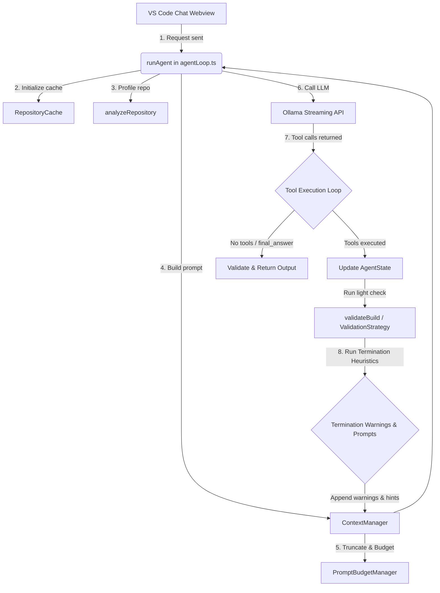

# GBS Local Dev: Agent Architecture

This document explains the architecture of the **GBS Local Dev** software agent extension, detailing how each component works, the role of each file, and the overall execution flow.

---

## 1. High-Level Flow Diagram

The following diagram illustrates the execution cycle of the agent loop when a user submits a request.

---

## 2. Core Components and File Map

### Extension & Webview Setup
* **[src/extension.ts](file:///d:/inittest_vsext/gbs-local-dev/src/extension.ts)**
  * **Role:** The main entry point for the VS Code extension.
  * **Key Functions:** `activate()` registers commands and initializes the GBS Dev Activity Bar WebView.
* **[src/chatView.ts](file:///d:/inittest_vsext/gbs-local-dev/src/chatView.ts)**
  * **Role:** Webview Sidebar provider that renders the chat interface.
  * **Key Functions:** `resolveWebviewView()` registers event listeners to exchange message payloads between the UI and the agent runtime thread.

### Agent Core
* **[src/agent/agentLoop.ts](file:///d:/inittest_vsext/gbs-local-dev/src/agent/agentLoop.ts)**
  * **Role:** Orchestrates the step-by-step thinking loop of the agent (max 20 iterations).
  * **Key Functions/Helpers:**
    * `runAgent()`: Orchestrates cache initialization, prompting, LLM communication, tool execution, state updates, validation loops, and termination alerts.
    * `hashString()`: Helper to compute a simple 32-bit hash value for edit signatures.
    * `detectLoopPattern()`: Detects repeated or reversed/toggled modifications on the same file to prevent reasoning cycles.
    * `extractToolCalls()`: Parses and extracts JSON objects containing tool invocations from LLM markdown.
* **[src/agent/context.ts](file:///d:/inittest_vsext/gbs-local-dev/src/agent/context.ts)**
  * **Role:** Handles prompt composition and keeps conversation history.
  * **Key Functions:** `getMessages()` builds the LLM input payload by combining the system rules, repository profile, user request, dynamic state summary, and recent chat history.
* **[src/agent/budget.ts](file:///d:/inittest_vsext/gbs-local-dev/src/agent/budget.ts)**
  * **Role:** Controls prompt context size.
  * **Key Functions:** `PromptBudgetManager.enforce()` applies a 4-step trimming strategy to keep prompts under `MAX_CONTEXT_TOKENS = 3000` (approx 12,000 characters) and history length under 3 interactions. Completed objectives are injected here using checkmark (`✓`) formatting.
* **[src/agent/types.ts](file:///d:/inittest_vsext/gbs-local-dev/src/agent/types.ts)**
  * **Role:** Defines core TypeScript structures like `Tool`, `Message`, and `AgentState` (extended with `finishHints` tracking).

### Repository & Cache
* **[src/agent/cache.ts](file:///d:/inittest_vsext/gbs-local-dev/src/agent/cache.ts)**
  * **Role:** Singleton workspace cache storing workspace files list and contents.
  * **Key Functions:**
    * `initialize()`: Non-blocking startup method that scans directories and runs the analyzer.
    * `getFileContent()`: Lazily reads files from disk and triggers `SymbolIndex.indexFile()` on the fly.
    * `scheduleReindex()`: Debounces metadata rebuilding (2 seconds of silence) on file creation/deletion events.
* **[src/agent/analyzer.ts](file:///d:/inittest_vsext/gbs-local-dev/src/agent/analyzer.ts)**
  * **Role:** Analyzes root configuration files to identify project language and framework.
  * **Key Functions:** `analyzeRepository()` scans config files (like `package.json`, `Cargo.toml`, `go.mod`) to configure appropriate build/test targets.

### Validation & Verification
* **[src/agent/validator.ts](file:///d:/inittest_vsext/gbs-local-dev/src/agent/validator.ts)**
  * **Role:** Verifies project correctness after modifications.
  * **Key Functions:**
    * `validateBuild()`: Initiates checks depending on the workspace project configuration.
    * `ValidationStrategy.getValidationCommand()`: Computes the lightest targeted check (e.g., eslint on changed files, type check, cargo check) to avoid full builds when possible.
* **[src/agent/errorExtractor.ts](file:///d:/inittest_vsext/gbs-local-dev/src/agent/errorExtractor.ts)**
  * **Role:** Compresses build failure logs before sending them to the LLM.

---

## 3. Tool Ecosystem

All tools extend the `Tool` interface and expose standard JSON schemas to improve selection reliability. They are managed inside **[src/agent/registry.ts](file:///d:/inittest_vsext/gbs-local-dev/src/agent/registry.ts)**:

1. **`list_workspace_files` ([listFiles.ts](file:///d:/inittest_vsext/gbs-local-dev/src/agent/tools/listFiles.ts))**: Exposes relative paths of all workspace files.
2. **`read_file` ([readFile.ts](file:///d:/inittest_vsext/gbs-local-dev/src/agent/tools/readFile.ts))**: Reads content from files.
3. **`write_file` ([writeFile.ts](file:///d:/inittest_vsext/gbs-local-dev/src/agent/tools/writeFile.ts))**: Overwrites or creates complete file contents.
4. **`create_file` ([createFile.ts](file:///d:/inittest_vsext/gbs-local-dev/src/agent/tools/createFile.ts))**: Initializes new files.
5. **`replace_in_file` ([replaceInFile.ts](file:///d:/inittest_vsext/gbs-local-dev/src/agent/tools/replaceInFile.ts))**: Incremental search-and-replace tool. Normalizes line endings (`\r\n` vs `\n`) and rejects non-unique target blocks. Immediately returns `"NO_CHANGES_REQUIRED"` if search and replace blocks match without modifying files.
6. **`search_symbols` ([searchSymbols.ts](file:///d:/inittest_vsext/gbs-local-dev/src/agent/tools/searchSymbols.ts))**: Performs highly efficient symbol-index lookups via `SymbolIndex`. Falls back to text search only on cached files.
7. **`run_terminal_command` ([runCommand.ts](file:///d:/inittest_vsext/gbs-local-dev/src/agent/tools/runCommand.ts))**: Runs shell operations in the workspace root.
8. **`finish` ([finish.ts](file:///d:/inittest_vsext/gbs-local-dev/src/agent/tools/finish.ts))**: Terminating tool to signal task completion. Stops reasoning and returns summary.

---

## 4. Loop Prevention & Termination Heuristics

The agent loop utilizes deterministic heuristics instead of active LLM checks to prevent runaway reasoning loops and reduce token consumption:

* **Duplicate Read Protection**: If a file is re-read by the agent and its content matches the cache from the previous read, the loop returns cached content and appends a warning reminder to discourage redundant reads. This increments the `finishHints` counter.
* **Modification Budgets**:
  * **Per-File Budget**: Caps edits to a single file at 5 per session execution. Exceeding this triggers a budget warning.
  * **Global Budget**: Caps total edits across all files at 15 per session execution. Exceeding this triggers a global budget reminder.
* **Simplified Loop Detection**: Extracts string signatures `(searchHash -> replaceHash)` for `replace_in_file` edits. If the same file is modified $\ge 3$ times, it flags a loop if a signature is repeated or reversed/toggled.
* **Completion Reminder Heuristic**: If the build successfully compiles, at least one file has been modified, and at least one objective is completed, the prompt nudges the model to consider calling `finish`.
* **Finish Hints Coordination**: Subtle warning triggers (duplicate reads, loop signatures, budget alerts, compile passes) increment `finishHints`. When `finishHints >= 3`, a strong bias towards calling the finish tool is injected into the next prompt.
