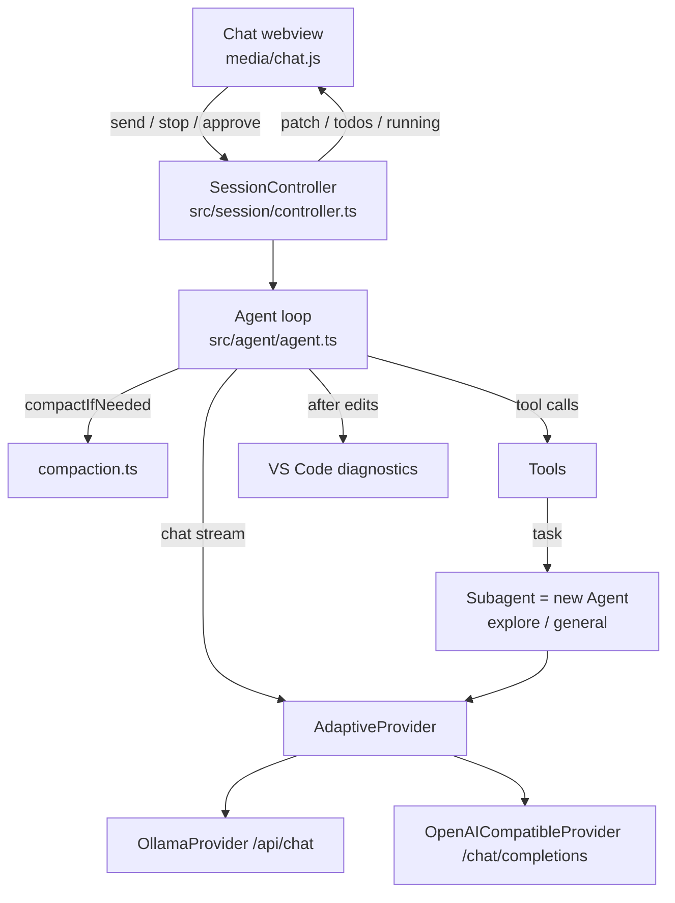

# GBS Agent — Architecture

GBS Agent is a VS Code extension that runs an autonomous coding agent against a local (Ollama) or OpenAI-compatible model. It follows the same design as Claude Code: a single tool-calling loop over an append-only conversation, a small set of precise tools, subagents for context-heavy research, and a UI that shows every step.

## Request flow

```mermaid
graph TD
    UI[Chat webview<br/>media/chat.js] -- send / stop / approve --> C[SessionController<br/>src/session/controller.ts]
    C -- patch / todos / running --> UI
    C --> A[Agent loop<br/>src/agent/agent.ts]
    A -- compactIfNeeded --> K[compaction.ts]
    A -- chat stream --> P[AdaptiveProvider]
    P --> O[OllamaProvider /api/chat]
    P --> OA[OpenAICompatibleProvider /chat/completions]
    A -- tool calls --> T[Tools]
    T -- task --> S[Subagent = new Agent<br/>explore / general]
    S --> P
    A -- after edits --> D[VS Code diagnostics]
```

Each user message starts a **turn**. The agent calls the model with the system prompt, the tool schemas, and the conversation. It executes any tool calls, appends the results, and repeats until the model answers without tools (or `gbsAgent.maxSteps` is reached).

## Source map

| Path | Responsibility |
|---|---|
| `src/extension.ts` | Activation: output channel, controller, webview provider, diff content provider, commands. |
| `src/config.ts` | Typed settings, config updates, API-key lookup (SecretStorage → settings → env). |
| `src/llm/types.ts` | Provider-neutral `LlmMessage`, `ToolCall`, `ToolSpec`, `ChatResult`. |
| `src/llm/http.ts` | `postJson` with clear connection errors, `readLines` (buffers partial lines across chunks), cancellation. |
| `src/llm/ollama.ts` | Native Ollama chat with tools, thinking, usage (`prompt_eval_count`/`eval_count`), `num_ctx`. |
| `src/llm/openai.ts` | OpenAI-compatible SSE streaming; assembles tool-call argument fragments; usage via `stream_options`. |
| `src/llm/adaptiveProvider.ts` | Uses native tool calling; on "model does not support tools" switches that model to a text protocol. Also recovers `<tool_call>` text from models that emit it inline. |
| `src/llm/textToolCalls.ts` | Text tool protocol: prompt, history conversion, parsing, and a stream filter that hides tool markup from the UI. |
| `src/agent/agent.ts` | The loop. Parallel execution of concurrency-safe calls, ordered results, approvals, repeat detection, diagnostics after edits, continuation on output-length stops. |
| `src/agent/prompts.ts` | Main / explore / general system prompts plus a cached environment block (OS, shell, project profile, git branch, root listing, `AGENTS.md`/`CLAUDE.md` instructions). |
| `src/agent/compaction.ts` | Token estimate, tool-output elision, LLM summarization, repair of interrupted tool calls. |
| `src/agent/tools/*` | Tool implementations (below). |
| `src/agent/workspace.ts` | Path containment, editor-aware read/write, version tokens, diff stats. |
| `src/agent/diagnostics.ts` | Waits briefly for language servers and reports errors in edited files. |
| `src/agent/permissions.ts` | Permission modes and session "always allow" rules. |
| `src/agent/snapshots.ts` | In-memory pre-edit contents for VS Code's diff editor. |
| `src/agent/analyzer.ts` | Detects language, framework, package manager, and build/test commands. |
| `src/session/controller.ts` | Owns the active session: runs turns, queues messages sent mid-run, batches UI updates (40 ms), approvals, usage, per-turn changed-file summary, model listing. |
| `src/session/store.ts` | Chat history in `workspaceState` (nothing is written into the repository). |
| `src/ui/chatViewProvider.ts` | Webview HTML with a strict CSP; `retainContextWhenHidden` keeps runs visible when the panel is hidden. |
| `media/chat.js`, `media/chat.css` | Dependency-free UI: transcript, markdown renderer, tool/subagent cards, todos, approval cards, composer, model and history menus. Styled entirely with VS Code theme tokens. |

## Tools

| Tool | Notes |
|---|---|
| `read_file` | Line-numbered output, `offset`/`limit` (1000 lines by default), binary detection. Records the file's version for the edit guard. |
| `edit_file` | Exact string replacement (`replace_all` optional), CRLF tolerant, near-miss hint on failure. Requires an up-to-date read. |
| `write_file` | Create or overwrite; overwriting requires an up-to-date read. |
| `grep` | VS Code's bundled ripgrep (JS fallback); `files_with_matches` / `content` / `count`, glob filter, result caps. |
| `glob` | `workspace.findFiles` with dependency/build folders excluded, 200-result cap. |
| `list_dir` | One directory level. |
| `run_command` | Non-interactive shell with timeout, process-tree kill on timeout/stop, head+tail output truncation, live output in the UI. |
| `todo_write` | Task checklist shown above the composer. |
| `task` | Subagent. `explore` gets read-only tools and runs concurrently; `general` can edit and run commands. Only its final report enters the main context. |

Read-only tools (and explore subagents) run in parallel when the model batches them. Mutating tools run sequentially in the order requested.

## Keeping token usage low

- **Stable prefix.** The system prompt and tool schemas are byte-identical for every step of a session (the environment block is cached). History is append-only, so Ollama's KV cache and provider prompt caches are reused. Fixed overhead is about 2.6k tokens for the main agent and about 1.2k for explore subagents.
- **Subagents.** Broad searches happen in a subagent's own context and return a short report. `gbsAgent.subagentModel` can point at a smaller, cheaper model.
- **Bounded tool output.** Reads are ranged, searches are capped, command output keeps only head and tail, and everything is truncated at `gbsAgent.maxToolOutputChars`.
- **Compaction.** When a new turn starts, large tool outputs from earlier turns are replaced with stubs. When the estimated prompt nears the context window, older tool outputs are elided first, then older history is summarized by the model (`/compact` forces this).
- **Diagnostics instead of builds.** After edits, the agent gets language-server errors for the changed files. It no longer runs a full build after every step. The model runs build/test commands only when warranted.
- **No heuristic nagging.** Context is no longer thrown away, so the old anti-loop warnings (which were themselves appended to every prompt) are gone. A single note is added only when the exact same call repeats three times.

## Permissions

`gbsAgent.permissionMode` (switchable from the composer):

- `ask`: approve every edit and command.
- `acceptEdits` (default): ordinary edits apply automatically; commands need approval. A short list of exact read-only commands is pre-approved (`SAFE_COMMANDS` in `src/agent/permissions.ts`).
- `auto`: never ask.

Outside `auto`, these always need approval:
- Edits to sensitive paths (`SENSITIVE_WRITE`): editor, git, and CI config; `package.json`; scripts; linter, test, and build configs that editor extensions execute automatically; dependency folders.
- Reads of likely credential files (`SENSITIVE_READ`).
- Commands containing shell operators or invisible characters.

"Always allow" records a rule (`ruleFor`): a prefix such as `npm run build` or `git commit`, or only the exact command for interpreters, downloaders, and destructive tools. It is never offered for sensitive files or chained commands. Every edit records a snapshot, and the turn summary and tool rows have a diff button that opens VS Code's diff editor.

## Security model

| Threat | Defence |
|---|---|
| Hostile `.vscode/settings.json` | Provider, model, endpoints, key, shell, and permission mode are scoped `application`/`machine` and read only from user settings (`PROTECTED_SETTINGS` in `src/config.ts`). `capabilities.untrustedWorkspaces.supported: false`. |
| API key exfiltration | Secret-storage key bound to its origin (`getApiKey`); `redirect: "error"` on authenticated requests. |
| Code sent off-machine unknowingly | One-time consent per remote destination (`confirmRemote`); "cloud" badge in the UI. |
| Prompt injection → actions | Untrusted-content rules in the system prompt; sensitive-path approvals; tool calls only parsed from a trailing `<tool_call>` block, never from prose or code fences (`parseTextToolCalls`). |
| Command hijacking | `NoDefaultCurrentDirectoryInExePath=1` (Windows), `core.fsmonitor=false` via `GIT_CONFIG_*`, exact-match safe commands. |
| Credential leakage | Secret-looking environment variables removed from commands (`commandEnvironment`); credential files excluded from grep and gated for reads. |
| Workspace escape | `resolvePath` resolves symlinks and junctions (`realPath`) before the containment check. |
| Approval spoofing | Full command shown; warnings for chained, network, and redirect commands; invisible or bidirectional characters highlighted. |
| Resource abuse | Subagent caps, response size and stall limits, 10 MB read limit, regex guard in the fallback search. |

## UI protocol

The host is the source of truth. The webview sends `ready`, `send`, `stop`, `approve`, `newChat`, `switchSession`, `deleteSession`, `openFile`, `openDiff`, `setConfig`, `listModels`, and `openSettings`. The host replies with `init` (full state), then incremental `patch` messages (changed transcript items, removed ids, activity, usage, title), plus `running`, `todos`, `sessions`, `config`, `editor`, and `models`.

Transcript items (`src/agent/transcript.ts`) are `user`, `assistant` (streaming text and thinking), `tool` (status, title, output preview, live tail, diff stats, approval request, subagent progress, optional `parentId` for nesting), `notice`, and `summary`.

## Testing

- `npm test` runs the integration suite in a real VS Code instance against a throwaway fixture workspace (`.vscode-test/fixture-workspace`). It covers the tools against real VS Code APIs, workspace containment, the stale-read guard, diagnostics, and full agent turns through `SessionController` against a mock Ollama server, including parallel explore subagents and stopping during an approval.
